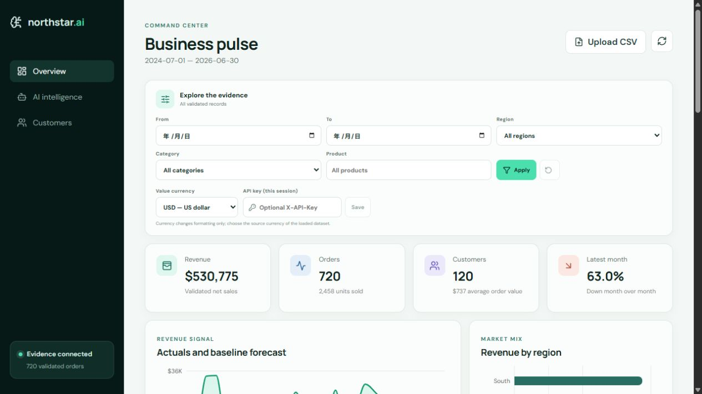
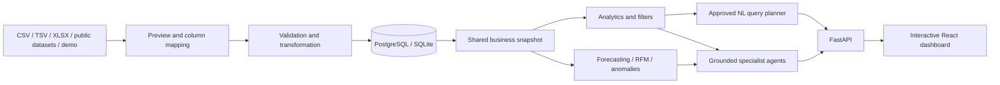
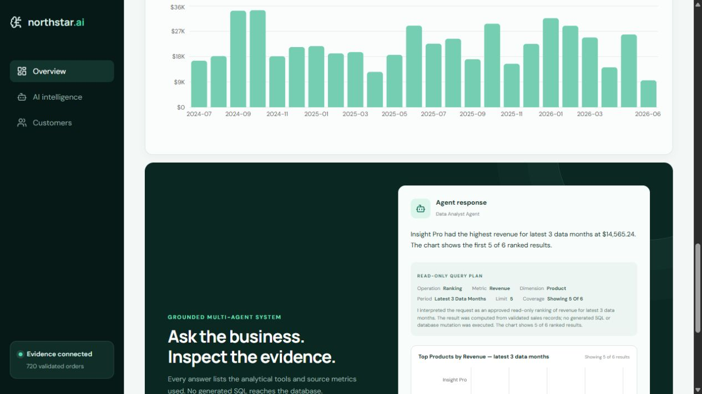

# Enterprise AI Business Intelligence Agent

A portfolio-level, end-to-end business intelligence platform that turns sales
data into validated analytics, evaluated machine-learning outputs, and grounded
executive insights.

The project implements the supplied enterprise AI BI plan as a working MVP. It
is intentionally usable without an LLM key: specialist agents call approved
analytics and ML tools and expose the evidence behind every conclusion.

## What is included

- Guided CSV, TSV, and XLSX sales-data imports with column mapping, preview,
  normalization, data-quality checks, and atomic database activation
- KPI cards, trends, ranked product analysis, date/region/category/product
  filters, and regional drill-down
- Source-currency display for USD and GBP datasets without implicit FX conversion
- Revenue forecast candidate selection with chronological holdout MAE and RMSE
- RFM customer segmentation with K-Means
- Sales-record anomaly detection with Isolation Forest
- Grounded Data Analyst, Forecasting, Customer Intelligence, Anomaly Detection,
  and Executive agents
- Bounded English/Chinese business questions with read-only query plans,
  chart-ready evidence, explanations, and tool provenance
- FastAPI backend and responsive React dashboard
- SQLite for zero-configuration local use and PostgreSQL in Docker Compose
- Optional API-key protection, bounded rate limiting, request tracing, JSON access
  logs, readiness checks, and Prometheus-compatible metrics
- Pytest, Ruff, GitHub Actions, CodeQL, container builds, dependency updates, and
  an English changelog gate



## Architecture at a glance



## Quick start with Docker

```bash
docker compose up --build
```

Open the dashboard at <http://localhost:5173> and API documentation at
<http://localhost:8000/docs>. Select **Load demo data** to seed a deterministic
portfolio dataset.

For a same-origin, hardened single-host profile, follow the
[production deployment guide](docs/deployment.md). The profile exposes only the
Nginx dashboard and keeps PostgreSQL and FastAPI on an internal network.

## Local development

Backend:

```powershell
python -m venv .venv
.\.venv\Scripts\Activate.ps1
pip install -e ".[dev]"
Copy-Item .env.example .env
uvicorn backend.app.main:app --reload --env-file .env
```

Frontend, in a second terminal:

```powershell
cd frontend
Copy-Item .env.example .env.local
pnpm install
pnpm dev
```

The default database is `sqlite:///./enterprise_ai_bi.db`. Copy `.env.example`
to `.env` to override backend settings. When changing `API_KEY_HEADER`, keep
`frontend/.env.local`'s `VITE_API_KEY_HEADER` identical; the production Compose
build passes the same value automatically.

## Code organization

- `backend/app/api/` contains small domain routers; `main.py` only builds and
  configures the FastAPI application.
- `BusinessIntelligence` is a request-scoped facade. It materializes one sales
  snapshot and shares it across analytics, ML specialists, and executive
  reporting instead of repeating the database-to-DataFrame conversion.
- Validation, ingestion, forecasting, segmentation, and anomaly detection use
  configurable service classes. The original functions remain as stable
  compatibility wrappers.
- `frontend/src/api/`, `hooks/`, `components/`, and `utils/` separate transport,
  state orchestration, presentation, and formatting from the page layout.
- M5 candidate and selection records use explicit dataclasses while generated
  training artifacts remain outside version control.

## Flexible sales-data import

The dashboard can import bounded UTF-8 CSV, TSV, and `.xlsx` workbooks even when
their headers do not use the application's canonical names. Import is a
deliberate two-step workflow:

1. Choose a file and, for a workbook, a worksheet.
2. Preview its columns, sample rows, and conservative mapping suggestions.
3. Confirm or correct the mapping, source currency, and dataset meaning.
4. Activate the dataset. The server verifies that its SHA-256 still matches the
   preview; the existing dataset is replaced only after the file and mapping
   pass full validation.

Every import needs a sales date plus one of these monetary contracts:

| Required facts | How revenue is handled |
| --- | --- |
| `order_date` and direct `revenue` | The source line total is preserved in the canonical sales facts. |
| `order_date`, `quantity`, and `unit_price` | Revenue is derived as `quantity * unit_price * (1 - discount)`. |

Order ID, customer ID, region, category, product, and discount are optional in
the flexible workflow. The preview makes every generated identifier or default
label explicit and reports the analytical features that will be unavailable or
less meaningful as a result. Repeated, blank, or missing order IDs receive
deterministic unique row IDs and are labeled as sales records rather than
orders. A missing customer field becomes one `UNSPECIFIED-ENTITY` instead of
inventing customers. Suggestions never activate data by themselves; ambiguous
columns require a manual choice.

Choose the file's source currency during import. A mapped currency-code column
must contain one consistent `USD` or `GBP` value on every row; recognizable
currency columns cannot be ignored, and mixed or unsupported currencies fail
closed. Inline symbols/codes are checked by the same rule. When direct revenue
is mapped without quantity, revenue analysis remains available but unit KPIs and
quantity-based model features are explicitly unavailable rather than synthesized.

The legacy `POST /api/data/upload` route remains available for existing tools.
Its optional multipart `source_currency` field defaults to `USD`, and
`source_profile=order_level` is the safe default. Prepared project artifacts
must explicitly send `source_profile=m5`, `source_profile=uci`, or
`source_profile=iowa`; UCI is locked to GBP and M5/Iowa are locked to USD.
Each prepared choice accepts only the complete project-generated output contract with
the exact canonical nine-column mapping, row/date coverage, IDs, and documented
dimensions. This is structural validation of an operator-selected profile, not
authentication against a trusted artifact digest. Use the automatic profile for
a subset or a modified derivative.
It accepts a UTF-8 CSV with the nine canonical columns below and applies the
same final validator:

`order_id`, `order_date`, `customer_id`, `region`, `category`, `product`,
`quantity`, `unit_price`, and `discount`.

This is a flexible adapter for tabular sales data, not a general-purpose
analytics engine for unrelated domains. Negative sales/returns, currencies
other than the existing USD/GBP source-label choices, implicit currency
conversion, legacy `.xls`, macro-enabled workbooks, and encrypted workbooks are
not accepted. Source IDs that must retain leading zeroes should be stored as
text in Excel.

## Walmart M5 workflow

The M5 pipeline consumes the official `calendar.csv`, `sell_prices.csv`, and
`sales_train_evaluation.csv` files. It verifies the University of Nicosia
Zenodo v1 sizes and MD5 checksums before processing. Obtain and use the files
only after reviewing the original Kaggle competition rules.

```powershell
python scripts/run_m5_pipeline.py `
  --data-dir C:\path\to\m5\raw `
  --output-dir C:\path\to\m5\artifacts `
  --stage all
```

All 30,490 item-store series and 1,941 observed days participate in revenue and
unit aggregation. The prepared store-category grain contains 30 series and is
small enough for this portfolio API. The training stage uses the 28 days before
the final holdout to select a global model and calibrate a seasonal blend. It
then refits the selected model and evaluates it once on the final 28 observed
days. The current selected model is a 300-tree Extra Trees regressor with 28
calendar, hierarchy, lag, rolling, event, SNAP, and lagged-price features.
Reported metrics are a one-step project holdout evaluation, not the
competition's official WRMSSE.

Generated data and model files are intentionally excluded from Git. The
`m5_application_sales.csv` output can be uploaded through the guided import by
choosing **Prepared Walmart M5**, or through the API with
`source_profile=m5&source_currency=USD` multipart fields.
M5 stores act as customer proxies because the source contains no shoppers. Its
generated IDs are store-category-day records, not orders, so record count and
average record value are not order count or average order value. The server
validates the explicit profile against its required mappings, currency, entity
IDs, and generated-ID prefix before applying these labels and natural-language
caveats. The application export is passed through
the same canonical upload validator used by the API, including its two-decimal
unit-price precision. `m5_preparation_summary.json` records `application_rows`,
`application_revenue`, and `revenue_reconciliation_delta` so the effect of that
precision is explicit and auditable.

## UCI and Iowa public-sales workflows

The public-sales pipeline downloads, verifies, cleans, aggregates, and analyzes
two additional official datasets:

- UCI Online Retail II, a 2009-2011 UK online retailer transaction workbook.
- Iowa Liquor Sales, 2024, the complete five-part calendar-year export.

```powershell
python -m scripts.run_public_sales_pipeline `
  --source uci `
  --data-dir C:\path\to\public-sales\raw\uci `
  --output-dir C:\path\to\public-sales\artifacts\uci `
  --stage all

python -m scripts.run_public_sales_pipeline `
  --source iowa `
  --data-dir C:\path\to\public-sales\raw\iowa `
  --output-dir C:\path\to\public-sales\artifacts\iowa `
  --stage all
```

Downloads are atomic and every preparation summary records the source URL,
byte size, SHA-256, cleaning counts, output grain, source revenue, application
revenue, and rounding reconciliation. The UCI output is denominated in GBP;
the Iowa output is denominated in USD. Do not combine the two monetary series
without an explicit exchange-rate policy. In the guided import choose
**Prepared UCI Online Retail II** or **Prepared Iowa Liquor Sales 2024**. API
clients must send `source_profile=uci&source_currency=GBP` or
`source_profile=iowa&source_currency=USD`; ID prefixes are validated but never
used alone as provenance. The prepared choice also checks the complete artifact
coverage and row contract. Raw and generated files remain
outside version control. See the [verified run report](docs/public-sales-datasets.md)
for exact results, licenses, caveats, and artifact contracts.

## API overview

| Endpoint | Purpose |
| --- | --- |
| `POST /api/data/demo` | Replace current data with deterministic demo records |
| `POST /api/data/preview` | Inspect a CSV, TSV, or XLSX file without changing active data |
| `POST /api/data/import` | Validate a mapping and atomically activate the sales dataset |
| `GET /api/data/profile` | Describe the active source, mapping, generated fields, and warnings |
| `POST /api/data/upload` | Compatibility route for a canonical nine-column CSV |
| `GET /api/analytics/filter-options` | Available dates and business dimensions |
| `GET /api/dashboard` | One-snapshot dashboard analytics and optional ML results |
| `GET /api/analytics/kpis` | Core portfolio KPIs |
| `GET /api/analytics/trends` | Monthly or daily revenue trend |
| `GET /api/analytics/breakdown/{dimension}` | Region/category/product analysis |
| `GET /api/ml/forecast` | Forecast plus evaluation metrics |
| `GET /api/ml/segments` | RFM customer segments |
| `GET /api/ml/anomalies` | Ranked anomalous sales records |
| `POST /api/insights/query` | Grounded natural-language analysis |
| `GET /api/reports/executive` | Evidence-backed executive report |

Analytics and ML endpoints accept optional `start_date`, `end_date`, `region`,
`category`, and `product` query parameters. The dashboard applies one filter
contract to its KPIs, charts, ML outputs, and natural-language evidence.
The same query parameters can scope the executive report endpoint.
The bundled dashboard route reads one filtered snapshot instead of loading the
sales table once per card. Date and dimensional filters are applied by the
database before rows are converted for analytics. If a narrow selection is too
small for forecasting, segmentation, or anomaly detection, core KPIs and charts
still return with a model-specific explanation.
Dashboard, filter-option, and profile responses carry the active dataset
fingerprint. The browser accepts a refresh only when all fingerprints and
currencies match, and retries once if an import changes the dataset mid-refresh.

Example bounded questions include:

- `Top 5 products by revenue in the latest 3 months`
- `Monthly orders for 2024`
- `2024 年前 10 個地區的銷售額`
- `Why did revenue change in the latest month?`

The first three compile to an enumerated, read-only analytical plan and return
chart data. Change explanations, forecasts, customer intelligence, anomalies,
and executive summaries route to grounded specialist tools. SQL text and data
mutation requests are rejected before execution.

The active dataset profile is authoritative for monetary labels in insights and
executive reports. Currency is selected during import and cannot be overridden
by a request to relabel values; the system never performs implicit exchange-rate
conversion. A database created before profiles existed is the deliberate
exception: startup preserves its rows under an unverified **Legacy sales
snapshot**, lets the operator choose the display currency, and requires a source
re-import before currency or entity meaning is treated as verified. Legacy row
shapes or ID prefixes never establish currency provenance.



## Quality and update policy

Run all checks before committing:

```bash
ruff check .
pytest --cov=backend --cov=data_pipeline --cov=ml
cd frontend && pnpm build
```

Every meaningful update must add an English entry to `CHANGELOG.md`. Pull
requests are blocked by CI when implementation files change without a changelog
update. See `CONTRIBUTING.md` for the exact workflow.

## Architecture and security

- [Architecture](docs/architecture.md)
- [Project completion and portfolio guide](docs/project-completion.md)
- [Production deployment](docs/deployment.md)
- [Public sales datasets](docs/public-sales-datasets.md)
- [Security model](SECURITY.md)
- [Contribution workflow](CONTRIBUTING.md)
