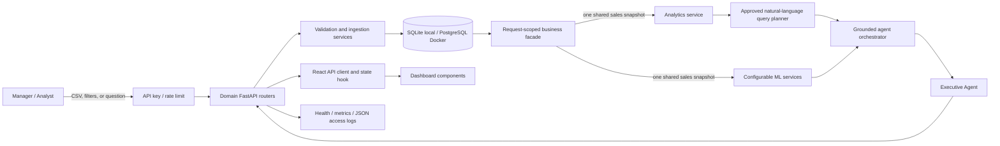

# Architecture

## System context

## Encapsulation boundaries

- The HTTP layer is divided into data, analytics, machine-learning, insight,
  and report routers. Route modules validate transport parameters and delegate
  business work; application construction stays in `main.py`.
- `BusinessIntelligence` owns the request-scoped sales snapshot and lazily
  exposes analytics and ML facades. A multi-specialist executive request issues
  one sales-table query rather than rebuilding the same frame per specialist.
- Analytics operate as pure methods over a supplied frame. ML classes own their
  parameters and expose one `run` method; stable function wrappers preserve the
  original external Python interface.
- One validated filter object applies date, region, category, and product
  constraints consistently across analytics and machine-learning endpoints.
- The React API client owns HTTP/error behavior, the dashboard hook owns async
  state transitions, and focused components own charts, lists, and intelligence
  presentation. `App.jsx` only composes the page.

## Trust boundary

The orchestrator is a read-only decision layer. Specialist intents call
registered Python tools. General business questions pass through a bounded
parser that can select only approved metrics, dimensions, periods, ranking
limits, and trend grains; it never generates SQL. Each response returns
`agents_used`, `tools_used`, structured `evidence`, and, when applicable, an
auditable query plan plus chart-ready data.

## Data lifecycle

1. The API accepts a bounded CSV upload or generates the deterministic demo set.
2. Validation canonicalizes headers and rejects missing identities, invalid
   dates, non-numeric facts, duplicate order IDs, negative values, and discounts
   outside 0–1.
3. Transformation derives revenue and converts types.
4. The ingestion service commits normalized records in one transaction and
   rolls the transaction back if persistence fails.
5. The request facade reads the relational store into one validated frame and
   shares that immutable snapshot across the required analytical services.
6. FastAPI returns structured outputs through the domain routers to the
   dashboard client and agent layer.

## ML design

- Forecasting compares linear trend, a recursive three-month trailing mean, and
  a 12-month seasonal-naive candidate when enough history exists. Selection
  uses a chronological holdout; MAE, RMSE, baseline improvement, candidate
  scores, and residual-spread intervals are surfaced with the forecast.
- Segmentation uses recency, frequency, and monetary features, StandardScaler,
  and deterministic K-Means initialization.
- Anomaly detection uses standardized sales-record features and Isolation Forest.
  Flags are explicitly described as investigation leads, not fraud labels.

The models are deliberately explainable. A production iteration can add richer
covariates, drift monitoring, experiment tracking, and reviewed model promotion
without changing the API boundary.

## Deployment topology

The production Compose profile runs PostgreSQL, a one-shot least-privilege role
initializer, an unprivileged FastAPI service, and an Nginx-hosted React bundle on
one public origin. The API connects with a dedicated non-superuser database role;
its root filesystem is read-only, and readiness checks prevent the dashboard from
starting before dependencies are available.
TLS and secret injection remain responsibilities of the selected host. Local
development uses SQLite by default to minimize setup.
