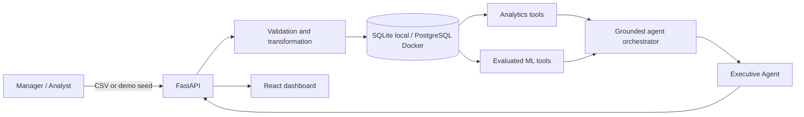

# Architecture

## System context

## Trust boundary

The orchestrator is a read-only decision layer. It classifies a question and
calls registered Python tools. It cannot submit generated SQL, mutate sales
records, or invent a metric that is absent from a tool result. Each response
returns `agents_used`, `tools_used`, and structured `evidence`.

## Data lifecycle

1. The API accepts a bounded CSV upload or generates the deterministic demo set.
2. Validation canonicalizes headers and rejects missing identities, invalid
   dates, non-numeric facts, duplicate order IDs, negative values, and discounts
   outside 0–1.
3. Transformation derives revenue and converts types.
4. The loader commits normalized records in one transaction.
5. Analytics and ML services read the relational store into purpose-specific
   frames.
6. FastAPI returns structured outputs to the dashboard and agent layer.

## ML design

- Forecasting uses a linear trend baseline with a chronological holdout. MAE,
  RMSE, and residual-spread intervals are surfaced with the forecast.
- Segmentation uses recency, frequency, and monetary features, StandardScaler,
  and deterministic K-Means initialization.
- Anomaly detection uses standardized transaction features and Isolation Forest.
  Flags are explicitly described as investigation leads, not fraud labels.

The baseline models are deliberately explainable. A production iteration can
add seasonal forecasting, drift monitoring, experiment tracking, and reviewed
model promotion without changing the API boundary.

## Deployment topology

Docker Compose runs PostgreSQL, the FastAPI service, and an Nginx-hosted React
bundle. Health checks prevent the dashboard from starting before the database
and API are ready. Local development uses SQLite by default to minimize setup.
