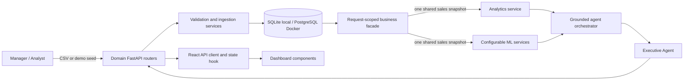

# Architecture

## System context

## Encapsulation boundaries

- The HTTP layer is divided into data, analytics, machine-learning, insight,
  and report routers. Route modules validate transport parameters and delegate
  business work; application construction stays in `main.py`.
- `BusinessIntelligence` owns the request-scoped sales snapshot and lazily
  exposes analytics and ML facades. A multi-specialist executive request issues
  one sales-table query rather than rebuilding the same frame per specialist.
- Analytics operate as pure methods over a supplied frame. ML classes own their
  parameters and expose one `run` method; stable function wrappers preserve the
  original external Python interface.
- The React API client owns HTTP/error behavior, the dashboard hook owns async
  state transitions, and focused components own charts, lists, and intelligence
  presentation. `App.jsx` only composes the page.

## Trust boundary

The orchestrator is a read-only decision layer. It classifies a question and
calls registered Python tools. It cannot submit generated SQL, mutate sales
records, or invent a metric that is absent from a tool result. Each response
returns `agents_used`, `tools_used`, and structured `evidence`.

## Data lifecycle

1. The API accepts a bounded CSV upload or generates the deterministic demo set.
2. Validation canonicalizes headers and rejects missing identities, invalid
   dates, non-numeric facts, duplicate order IDs, negative values, and discounts
   outside 0–1.
3. Transformation derives revenue and converts types.
4. The ingestion service commits normalized records in one transaction and
   rolls the transaction back if persistence fails.
5. The request facade reads the relational store into one validated frame and
   shares that immutable snapshot across the required analytical services.
6. FastAPI returns structured outputs through the domain routers to the
   dashboard client and agent layer.

## ML design

- Forecasting uses a linear trend baseline with a chronological holdout. MAE,
  RMSE, and residual-spread intervals are surfaced with the forecast.
- Segmentation uses recency, frequency, and monetary features, StandardScaler,
  and deterministic K-Means initialization.
- Anomaly detection uses standardized transaction features and Isolation Forest.
  Flags are explicitly described as investigation leads, not fraud labels.

The baseline models are deliberately explainable. A production iteration can
add seasonal forecasting, drift monitoring, experiment tracking, and reviewed
model promotion without changing the API boundary.

## Deployment topology

Docker Compose runs PostgreSQL, the FastAPI service, and an Nginx-hosted React
bundle. Health checks prevent the dashboard from starting before the database
and API are ready. Local development uses SQLite by default to minimize setup.
